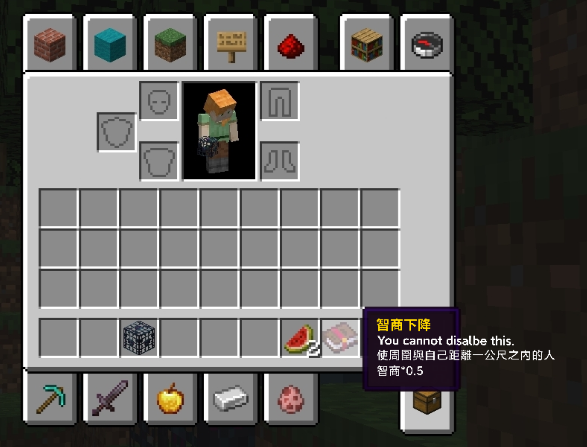

## **試場規則**

### **違規事項**

 - 行動裝置未置於教室外、教室前後、監考老師桌上、個人電腦主機上，經監考老師發現。
 - 於考試期間使用行動裝置。
 - 配戴具通訊功能的穿戴裝置。
 - 以任何方式使其他考生無法正常使用系統。
 - 考試期間與監考老師以外之人交談。

上述行為被發現，且屢勸不聽者，將登記於考生簽到表，並在賽後系統測試時將總成績 $\times 0.0001$   並四捨五入至個位。

### **賽制**

 - 本次競賽採`OI`制度，有部分分，無罰時，並取每筆提交的子題聯集為總分。
   - 例如：某題共有兩筆提交，第一筆通過子測資 $\\{1,2\\}$ 、第二筆通過子測資 $\\{2,3\\}$ ，則總分為第 $\\{1,2,3\\}$ 筆子測資的分數相加。
 - 本次為封板賽，記分板將在比賽結束後公布。
 - 競賽結束後會做一次***System test***(系統測試)，所有成績以其為準。
 - 提交的冷卻時間(CD time)為 $15$ 秒，最後 $30$ 分鐘不在此限。
 - 對於每一題，使用者最多可以進行 $100$ 筆提交。

### **系統使用說明**

 - 系統連結: [http://192.168.8.1](http://192.168.8.1/)
 - 競賽將在 ***2023/08/30 1:40 P.M.*** 開始，使用者有十分鐘的時間閱讀試場規則，確認讀畢後請按下系統上的開始鈕，以免影響競賽時間。
 - 最晚進場時間 ***2023/08/30 2:00 P.M.***
 - 最早離場時間 ***2023/08/30 2:30 P.M.***
 - 總題本在第***A***題的題目敘述頁面中。
 - 使用者允許許使用 ***C/C++11/C++17*** 提交程式碼。
 - 若結果為***Execution timed out (wall clock limit exceeded)***，則表示系統因為某筆提交繁忙中，請檢查你的程式碼使否有可能超過執行時間，並稍後再試。
 - 對於每筆提交，請確認副檔名符合系統要求，詳見系統頁面。
 - 如有題目問題，請使用系統提供的訊息詢問功能提問。
 - 如有其他問題，如：上廁所、需要計算紙、系統使用問題等，請直接舉手向監考老師發問。

### **資源**

 - 賽後我們將會在一天內**彰中資訊社群**公告本次題解、總成績。
 - 競賽後將擇期在 ***HARC Discord*** 上進行直播題解。
 - 網址：
   - [彰中資訊社群](https://www.facebook.com/groups/chshcs/)
   - [本次專案](https://mysh212.github.io/CHSH-nhspc112-PRI/)
   - [HARC Discord](https://2120.page.link/HARC)
   - [彰中資訊社Discord](https://2120.page.link/cdc)

<div style="page-break-after: always"></div>

## **A. 二維座標** ***<font color = '#AAAAAA'> Walk </font>***

`time limit` 1s
`memory limit` 256MB

### ***Statement***

***ysh*** 正在和 ***Cyana*** 玩一種遊戲

***Cyana*** 一開始須站在座標 $(0,0)$ ，每回合 ***Cyana*** 須向 $+x, -x, +y, -y$ 四種方向中挑一種並移動一單位。

給定一條直線 $y = ax + b, a \in \\{-1,1\\}$

經過 $k$ 個回合後，如果 ***Cyana*** 在該線上則獲勝

但是因為 ***Cyana*** 被 ***ysh*** 施加了 **智商下降** 的 ***buff***

所以現在請你答出 $k$ 個回合以後， ***Cyana*** 是否有獲勝的可能?





:::spoiler ***easier version***
有一個遊戲，玩家須站在座標 $(0,0)$ ，每回合玩家須向 $+x, -x, +y, -y$ 方向移動一單位。

給定一條直線 $y = ax + b, a \in \\{-1,1\\}$

現在請你答出 $k$ 個回合以後，玩家是否有任何在線上的可能?
:::

<div style="page-break-after: always"></div>

### ***Input***

$a$ $b$
$m$
$k_1$
...
$k_m$

共有 $m$ 筆詢問。

### ***Output***

$Ans$

對於每筆詢問，請輸出 $Yes$ 或是 $No$。

### ***Sample Input***

```
-1 40805
12
53624
74024
47730
27351
45806
61246
44756
97828
50519
85755
91912
77507
```

### ***Sample Output***

```
NO
NO
NO
NO
NO
NO
NO
NO
YES
YES
NO
YES
```

### ***Note***

$a \in \\{-1,1\\}$

$-10^{18} \leq b,k_i \leq 10^{18}, \forall\ 1 \leq i \leq m$

$1 \leq m \leq 10^5$

### ***Subtask***

 - ***subtask1***: $10\\%$ $|b|,|k_i| \leq 10^5$, $m \leq 100$
 - ***subtask2***: $10\\%$ $|b|,|k_i| \leq 10^5$, $m \leq 10^3$
 - ***subtask3***: $10\\%$ $|b|,|k_i| \leq 10^9$, $m \leq 10^4$
 - ***subtask4***: $10\\%$ $|k_i| \leq 10^{18}$, $b = 0$, $m \leq 10^5$
 - ***subtask5***: $10\\%$ $|b|,|k_i| \leq 10^9$, $m \leq 10^5$
 - ***subtask6***: $50\\%$ ***As statement***

<div style="page-break-after: always"></div>

## **B. 專賣店** ***<font color = '#AAAAAA'>Vendor</font>***

`time limit` 1s
`memory limit` 256MB

### ***Statement***

因為 ***Mingyee*** 訂冰炫風的時候沒有準備 ***ysh*** 的份，
所以 ***ysh*** 打算把所有口味一次訂來炫耀給 ***Mingyee*** 看。

而每間專賣店都販售的自己的獨家口味，也就是說，找不到另一間專賣店與任何一家專賣店口味相同。

為了達成目標， ***ysh*** 整理好了附近所有專賣店的位置，將這 $n$ 家專賣店繪於二維平面，並對第 $i$ 間專賣店賦予座標 $(x_i,y_i)$ ，其中 $1 \leq i \leq n$ 。

不過可悲的是因為他沒有駕照，只能訂外送，於是他決定移動到某個點 $(x,y),\ x,y \in Z$，並一次下訂這 $n$ 家冰炫風，運送到目前位置。

假設目的地座標為 $(a,b)$ ，專賣店位置為 $(c,d)$ ，則外送的運費為 $\sqrt{(a - c) ^ 2 + (b - d) ^ 2}$ 。

但是 ***ysh*** 錢包裡的錢比某 ***HARC*** 線上賽題目給的記憶體還少，所以請你幫他找出 **運費最低** 的目的地。

**註： 外賣系統很厲害，可以收取小數的金額，而且精度達到了驚人的 $10^{-19}$ ，雖然這並沒甚麼用**


### ***Input***

$n$\
$x_1$ $y_1$\
...\
$x_n$ $y_n$

### ***Output***

$x$ $y$

<div style="page-break-after: always"></div>

### ***Sample Input 1***

```
1
20 23
```

### ***Sample Output 1***

```
20 23
```

### ***Sample Input 2***

```
3
-15 -93
55 51
95 73
```

### ***Sample Output 2***

```
55 51
```

### ***Sample Input 3***

```
4
-47 13
-20 35
1 21
-76 -100
```

### ***Sample Output 3***

```
-28 16
```

<div style="page-break-after: always"></div>

### ***Note***

#### ***Input Restriction***

$1 \leq n \leq 2 \times 10^5$

$-10^6 \leq x_i,y_i \leq 10^6,\ \forall\ 1 \leq i \leq n$

#### ***Output Restriction***

$-10^6 \leq x,y \leq 10^6$

$x,y \in Z$

只要你的答案合法(如上)且 **你的答案所成的距離總和** $-$ **官解的距離總和** $<$ $1$,答案將被判定為 **<font color = '#55AA55'>答案正確</font>**

若答案並不符合上述規則，你有可能獲得

 - **輸出格式錯誤**
 - **答案錯誤**

### ***Subtask***

 - ***subtask1***: $1\\%$ $n \leq 1,\ -10^2 \leq x_i,y_i \leq 10^2$
 - ***subtask2***: $2\\%$ $n \leq 2,\ -10^2 \leq x_i,y_i \leq 10^2$
 - ***subtask3***: $3\\%$ $n \leq 3,\ -10^2 \leq x_i,y_i \leq 10^2$
 - ***subtask4***: $4\\%$ $n \leq 10,\ -10^2 \leq x_i,y_i \leq 10^2$
 - ***subtask5***: $20\\%$ $n \leq 10^3,\ -10^3 \leq x_i,y_i \leq 10^3$
 - ***subtask6***: $10\\%$ $(x_i \in \\{r|r = x_1\\}, 1 \leq i \leq n) \vee (y_i \in \\{r|r = y_1\\}, 1 \leq i \leq n)$
 - ***subtask7***: $30\\%$ $n \leq 2 \times 10^4$
 - ***subtask8***: $30\\%$ ***As statement***

<div style="page-break-after: always"></div>

## **C. E班的復仇** ***<font color = '#AAAAAA'> The revenge of class E</font>***

`time limit` 2s
`memory limit` 256MB

### ***Statement***

這次的期末考數學科有史以來範圍最多，題目最難，只有淺野跟赤羽有能力奮戰到最後一題，然而最後一題卻極其毒瘤有100個小題每一題都是以下形式

***你有 a, b, c 三個介於 1~9 的位數 $(digit)$ ，利用這三個數字和 +, -, \*運算子組成運算式請問可以產生多少不一樣的非負整數？***

注意！位數(digit)是可以合併再一起的，兩個1可以組成11
由於淺野的計算速度非常快，你可以寫個程式幫助赤羽讓他能贏下這場考試嗎？

現在給你一個正整數$T$代表有$T$筆測資
每筆測資有三個正整數$a, b, c$
請對於每筆測資回答可以產生多少不一樣的非負整數


### ***Input***

$T$\
$a_1 \space b_1 \space c_1$\
$a_2 \space b_2 \space c_2$\
.\
.\
.\
$a_T \space b_T \space c_T$

### ***Output***

$ans_1$
$ans_2$
.
.
.
$ans_T$

<div style="page-break-after: always"></div>

### ***Sample Input***
```
2
1 1 1
2 1 2
```
### ***Sample Output***
```
7
13
```
### ***Note***

$1 \leq a, b, c \leq 9$\
$1 \leq T \leq 729$

第一筆測資可以組成運算結果非負的運算式:\
$1+1+1=3$

$1+1-1=1$

$1+1 \times 1=2$

$1-1+1=1$

$1-1 \times 1=0$

$1 \times 1+1=2$

$1 \times 1-1=0$

$1 \times 1 \times 1=1$

$1+11=12$

$1 \times 11=11$

$11+1=12$

$11-1=10$

$11 \times 1=11$

共有7個不同的答案

<div style="page-break-after: always"></div>

### ***Subtask***

 

| $a, b, c \leq X$ | 分數
| -------- | -------- |
| $X  = 1$ | $1\\%$     |
| $X  = 2$ | $2\\%$     |
| $X  = 3$ | $3\\%$     |
| $X  = 4$ | $5\\%$     |
| $X  = 5$ | $7\\%$     |
| $X  = 6$ | $9\\%$     |
| $X  = 7$ | $11\\%$     |
| $X  = 8$ | $15\\%$     |
| $X  = 9$ | $47\\%$     |


<div style="page-break-after: always"></div>

## **D. 守護城牆** ***<font color = '#AAAAAA'> Protection </font>***

`time limit` 1s
`memory limit` 256MB

### ***Statement***
***那一天人類再度回想起了被巨人支配的恐懼...***
.
.
.
城牆被巨人入侵了，米卡莎為了協助人民們撤退到內層城牆，在前方與 $N$ 隻巨人奮鬥，身為第一名畢業的訓練兵，沒有一隻巨人是他的對手，但擊敗一隻身高為 $h_i$ 巨人需要 $h_i$ 秒的時間，而所有巨人現在正以每秒 $1$ 單位的速度移動過來，現在你知道每隻巨人離人民的距離 $d_i$ 和每隻巨人的身高 $h_i$ ，米卡沙一定會用最優的順序擊殺巨人，到底米卡莎能否成功守護所有人民呢？如果可以請輸出 $Yes$ 否則輸出 $No$


### ***Input***

$N$\
$d_1 \space d_2 \space ... d_N$\
$h_1 \space h_2 \space ... h_N$

### ***Output***

$ans$

### ***Sample Input 1***

```
1
1
1
```

### ***Sample Output 1***

```
Yes
```

<div style="page-break-after: always"></div>

### ***Sample Input 2***

```
5
1 3 10 7 5
1 2 3 3 1
```

### ***Sample Output 2***

```
Yes
``` 

### ***Sample Input 3***

```
7
10 2 4 8 9 3 5
1 1 1 1 1 3 1
```

### ***Sample Output 3***

```
No
```

### ***Note***

$1 \leq N \leq 10^5$\
$1 \leq d_i \leq 10^6$\
$1 \leq h_i \leq 10^4$

巨人在被攻擊時還是會持續移動\
如果巨人在被解決時剛好抵達，則算是米卡莎守護成功巨人不會對人民造成危害


### ***Subtask***

 - ***subtask1***: $21\\%$ $1 \leq N \leq 10, \space h_i=1$
 - ***subtask2***: $79\\%$ ***As statement***

<div style="page-break-after: always"></div>


## **E. 文字獄** ***<font color = '#AAAAAA'> Literary prison</font>***

`time limit` 2s
`memory limit` 256MB

### ***Statement***
***文字獄，是中國專制統治者對文人的一種政治迫害，《漢語大詞典》定義為「舊時謂統治者為迫害知識份子，故意從其著作中摘取字句，羅織成罪」***

大民皇帝很討厭拐杖糖，覺得很難吃，因為7跟拐杖糖長得很像，所以每當有文人寫$7$就會被皇帝派人抓走。

身處於文字獄時代的文人因為怕被皇帝大民無辜定罪，因此決定從新定義正整數，把有任何一個位數 $(digit)$ 出現 $7$ 的數字都要被移除。

一般大家大家所共同約定的正整數數列為
$[...6, 7, 8, 9, 10, 11, 12, 13, 14, 15, 16, 17...]$

但文字獄時代的正整數數列為
$[...6, 8, 9, 10, 11, 12, 13, 14, 15, 16, 18, 19...]$

也就是說7在文字獄時代要寫為8
那8在文字獄時代呢？
.
.
.
沒錯是要寫為9喔，因為8已經被使用了

以此類推17要寫為19

現在給你一個正整數$T$代表有$T$筆測資
每筆測資有一個正整數$N$請對於每筆測資輸出一個正整數$M$代表$N$在文字獄時代要寫作什麼

### ***Input***

$T$\
$N_1$\
$N_2$\
$.$\
$.$\
$.$\
$N_T$

### ***Output***

$M_1$\
$M_2$\
$.$\
$.$\
$.$\
$M_T$

<div style="page-break-after: always"></div>

### ***Sample Input***

```
10
1
3
5
22
10
100
913
45284234
4584589124
12345678910
```

### ***Sample Output***

```
1
3
5
24
11
121
1224
104190255
12844636965
34881513601
```

### ***Note***

$1 \leq T \leq 10^5$
$1 \leq N \leq 10^{12}$

### ***Subtask***

 - ***subtask1***: $4\\%$ $1 \leq N \leq 50$
 - ***subtask2***: $17\\%$ $1 \leq N \leq 10^5$
 - ***subtask3***: $79\\%$ ***As statement***

<div style="page-break-after: always"></div>

## **F. 練習時間** <font color = 'gray'>***Practice***</font>
`time limit` 1s

`memory limit` 512MB

### ***Problem***
***lingling***是一位熱衷於練習的天才小提琴家，他每天練習40小時，因此在三歲時獲得人生中第一個冠軍，四歲時拿下全國冠軍，五歲時拿下世界冠軍，六歲時取得醫師和律師執照(?)

最近他卻發現如果連續兩天練習小提琴，效率會下降，但又無法忍住自己的「琴癮」，於是他決定，在 $n$ 天內，必需「恰巧」出現一次「連續練習兩天」的狀況，且除了這兩天，任兩次練習必相隔至少一天。

然而***lingling***並不擅長算術，因此請你幫他算出在這 $n$ 天中，共有幾種可能的練習排程方式。


### ***Input***
$n$

其中 $n$ 代表***lingling***打算預先進行排程的天數。

### ***Output***
$Ans$

其中 $Ans$ 代表符合***lingling***預期的排程方法數。
由於答案可能很大，所以請將 $Ans$ 對 $10^9 + 7$ 取餘數。

### ***Note***
$2 \leq n \leq 10^6$

以下以**T**代表當天有練習，**F**代表當天休息。\
在範例1中，符合預期的方法為[**T**,**T**]，因此只有一種。\
在範例2中，符合預期的方法為[**T**,**T**,**F**],[**F**,**T**,**T**]，因此為兩種。\
在範例3中，符合預期的方法為[**T**,**T**,**F**,**F**,**F**],[**T**,**T**,**F**,**F**,**T**],[**T**,**T**,**F**,**T**,**F**],[**F**,**T**,**T**,**F**,**F**],[**F**,**T**,**T**,**F**,**T**],[**F**,**F**,**T**,**T**,**F**],[**F**,**F**,**F**,**T**,**T**],[**T**,**F**,**T**,**T**,**F**],[**T**,**F**,**F**,**T**,**T**],[**F**,**T**,**F**,**T**,**T**]，因此共10種。

<div style="page-break-after: always"></div>

### ***Sample input/output***

|  ***input1*** |  ***input2*** |  ***input3*** |    ***input4***   |
|:-------------:|:-------------:|:-------------:|:-----------------:|
|   ``` 2 ```   |   ``` 3 ```   |   ``` 5 ```   |     ``` 81 ```    |
| ***output1*** | ***output2*** | ***output3*** |   ***output4***   |
|   ``` 1 ```   |   ``` 2 ```   |   ``` 10 ```  | ``` 906166588 ``` |

### ***Subtask***

 - ***subtask1*** : $9\\%$ $n \leq 10$
 - ***subtask2*** : $51\\%$ $n \leq 100$
 - ***subtask3*** : $40\\%$ ***As statement***


<div style="page-break-after: always"></div>

## **G. 橘子** ***<font color = '#AAAAAA'> Oranges </font>***

`time limit` 1s
`memory limit` 1024MB

### ***Statement***

現在有$n$個盤子，第$i$個盤子上有$a_i$橘子。
你可以選擇任意一個數對($l, r, x$)滿足以下條件：

- $1 \le l \le r \le n$
- $1 \le x$
- $x \le a_i$，其中$l \le i \le r$

你可以從$l$到$r$的盤子上各拿走$x$棵橘子來吃。
請問你最多可以吃到幾顆橘子？

### ***Input***

$n$\
$a_1, a_2, ..., a_n$

- $n$為盤子的數量
- $a_i$為第$i$個盤子的橘子數量

### ***Output***

$Ans$

- 你可以吃到的橘子數量的**最大值**

<div style="page-break-after: always"></div>

### ***Sample Input 1***

```
6
2 4 4 9 4 9
```

### ***Sample Output 1***

```
20
```

### ***Sample Input 2***

```
6
200 4 4 9 4 9
```

### ***Sample Output 2***

```
200
```

### ***Note***

$1 \le n \le 10^4$\
$1 \le a_i \le 10^5$


<div style="page-break-after: always"></div>

## **H. 最淺樹** ***<font color = '#AAAAAA'> Minimum Height Trees </font>***

`time limit` 1s
`memory limit` 1024MB

### ***Statement***

給定一棵樹，你可以選擇任意一點作為此樹的根。
現在定義$h_i$為：當以結點$i$為根時的高度
請你求出$min_{i=1}^{n}h_i$

- 一棵有根樹的高度定義為**根和所有葉節點的距離中的最大值**

### ***Input***

$n$\
$u_1,v_1$\
$u_2,v_2$\
$...$\
$u_{n-1},v_{n-1}$

- $n$為樹的節點樹
- $u_i,v_i$為一條相連兩點的樹邊

### ***Output***

$H$

- $H=min_{i=1}^nh_i$

<div style="page-break-after: always"></div>

### ***Sample Input 1***

```
4
1 2
2 3
2 4
```

### ***Sample Output 1***

```
1
```

### ***Sample Input 2***

```
6
4 1
4 2
4 3
4 5
6 5
```

### ***Sample Output 2***

```
2
```

### ***Note***

$1 \le n \le 2 \times 10^5$
$1 \le u_i,v_i \le n$

### ***Subtask***

 - ***subtask1***: $7 \\%$ 給定的樹為一條鏈
 - ***subtask2***: $22 \\%$ $1 \le n \le 10^4$
 - ***subtask3***: $71 \\%$ $\text As \space statement$

<div style="page-break-after: always"></div>

## **I. 環** ***<font color = '#AAAAAA'> Cycles </font>***

`time limit` 1s
`memory limit` 1024MB

### ***Statement***

給定一個$n$點的無向完全圖和$k$個封閉的邊。

現在需要你求出在不使用任何封閉的邊的情況下，共有幾條哈密頓迴路($\text Hamiltonian \space cycle$)。哈密頓迴路為一個環，其剛好經過每一個點各一次。注意到，擁有相同邊集合的環只會被計算一次。舉個例子，環$\\{1\rightarrow2\rightarrow3\rightarrow4\rightarrow1\\}$和$\\{1\rightarrow4\rightarrow3\rightarrow2\rightarrow1\\}$, $\\{2\rightarrow3\rightarrow4\rightarrow1\rightarrow2\\}$皆相同，但和$\\{1\rightarrow3\rightarrow2\rightarrow4\rightarrow1\\}$不同。

因為答案很大，所以請輸出答案除以$9901$的餘數。

- 無向完全圖: 對於圖中任意相異兩點皆存在一條無向邊

### ***Input***

$n, \space k$\
$u_1, v_1$\
$u_2, v_2$\
$...$\
$u_k, v_k$

- $n$為無向完全圖點的數量
- $k$為封閉邊的數量
- $u_i, v_i$代表這兩點相連的邊為封閉邊

### ***Output***

$Ans \space \\% \space 9901$

<div style="page-break-after: always"></div>

### ***Sample Input 1***

```
4 1
1 2
```

### ***Sample Output 1***

```
1
```

### ***Sample Input 2***

```
8 4
1 2
2 3
4 5
5 6
```

### ***Sample Output 2***

```
660
```

### ***Note***

$3 \le n \le 300$\
$0 \le k \le 15$\
$1 \le u_i, v_i \le n$

### ***Subtask***

- ***subtask1***: $10\\%$ $3 \le n \le 10$
- ***subtask2***: $90\\%$ ***As statement***

<div style="page-break-after: always"></div>

## **J. 氣球** ***<font color = '#AAAAAA'> Balloon </font>***

`time limit` 1s
`memory limit` 256MB

### ***Statement***

給你共 $n$ 個氣球，玩第 $i$ 個能獲得 $a_i,\ 1 \leq i \leq n$ 的快樂度，但因為太快樂了，所以最讓人快樂的氣球會破掉。

於是聰明的你想了個辦法，你只挑 **一個區間** 的氣球玩，具體來說，你選了兩個整數 $l,r$ ， $1 \leq l \leq r \leq n$ ，並且把編號 $[l,r]$ 的氣球帶回家玩。

現在請問你能獲得最大的快樂度。

換句話說，即是:

給你有 $n$ 項的數列 $a_i, 1 \leq i \leq n$
請找出
$$
\max_{1 \leq l \leq r \leq n\ \land\ l,r \in N} (\sum_{k = l}^r f_k) - \max_{t = l}^r f_t
$$

### ***Input***

$n$\
$a_1$ $a_2$ ... $a_n$

### ***Output***

$Ans$

### ***Sample Input***

```
10
7 10 -4 6 6 10 3 3 -5 7
```

### ***Sample Output***

```
33
```

### ***Note***

$1 \leq n \leq 10^5$\
$10^{-9} \leq a_i \leq 10^9,\ \forall\ 1 \leq n$

### ***Subtask***

 - ***subtask1***: $3\\%$ $n \leq 100$
 - ***subtask2***: $7\\%$ $n \leq 10^3$
 - ***subtask3***: $20\\%$ $n \leq 10^5$, $-30 \leq a_i \leq 30,\ \forall\ 1 \leq i \leq n$
 - ***subtask4***: $10\\%$ $n \leq 10^5$, $0 \leq a_i \leq 10^9,\ \forall\ 1 \leq i \leq n$
 - ***subtask5***: $60\\%$ ***As statement***

<div style="page-break-after: always"></div>
