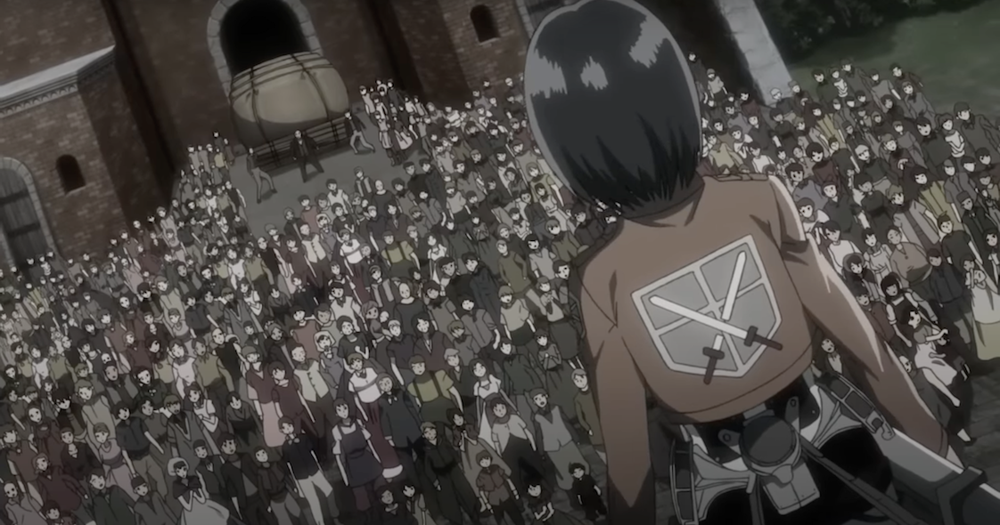

## **D. 守護城牆** ***<font color = '#AAAAAA'> Protection </font>***

`time limit` 1s
`memory limit` 256MB

### ***Statement***
***那一天人類再度回想起了被巨人支配的恐懼...***
.
.
.
城牆被巨人入侵了，米卡莎為了協助人民們撤退到內層城牆，在前方與 $N$ 隻巨人奮鬥，身為第一名畢業的訓練兵，沒有一隻巨人是他的對手，但擊敗一隻身高為 $h_i$ 巨人需要 $h_i$ 秒的時間，而所有巨人現在正以每秒 $1$ 單位的速度移動過來，現在你知道每隻巨人離人民的距離 $d_i$ 和每隻巨人的身高 $h_i$ ，米卡沙一定會用最優的順序擊殺巨人，到底米卡莎能否成功守護所有人民呢？如果可以請輸出 $Yes$ 否則輸出 $No$




### ***Input***

$N$\
$d_1 \space d_2 \space ... d_N$\
$h_1 \space h_2 \space ... h_N$

### ***Output***

$ans$

### ***Sample Input 1***

```
1
1
1
```

### ***Sample Output 1***

```
Yes
```

<div style="page-break-after: always"></div>

### ***Sample Input 2***

```
5
1 3 10 7 5
1 2 3 3 1
```

### ***Sample Output 2***

```
Yes
``` 

### ***Sample Input 3***

```
7
10 2 4 8 9 3 5
1 1 1 1 1 3 1
```

### ***Sample Output 3***

```
No
```

### ***Note***

$1 \leq N \leq 10^5$\
$1 \leq d_i \leq 10^6$\
$1 \leq h_i \leq 10^4$

巨人在被攻擊時還是會持續移動\
如果巨人在被解決時剛好抵達，則算是米卡莎守護成功巨人不會對人民造成危害


### ***Subtask***

 - ***subtask1***: $21\\%$ $1 \leq N \leq 10, \space h_i=1$
 - ***subtask2***: $79\\%$ ***As statement***

<div style="page-break-after: always"></div>
